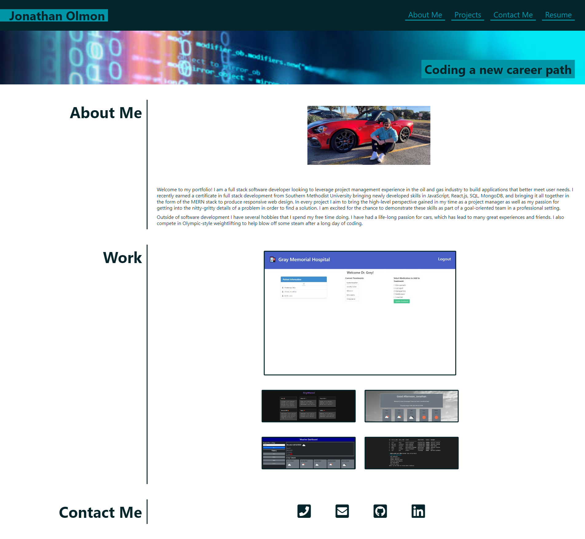

# React Portfolio

## Purpose

The purpose of this project was to create a personal website for me to use as a portfolio to showcase some of the projects I worked on during my coding bootcamp. This site uses React to create a responsive single-page layout for viewing on either desktop or mobile. 

The site can be found at: https://jpolmon.github.io/ReactPortfolio/

---
## Appearance

When visited the site should roughly appear as:  

